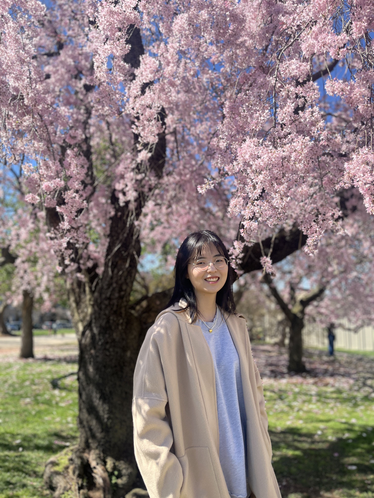

# About Me

Johanna is a junior at Wellesley College majoring in Computer Science and Mathematics. She is interested in web credibility and data analysis using machine learning. In her free time, she likes to take a walk on campus, collect stickers, and facetime her friend's dog.

 

