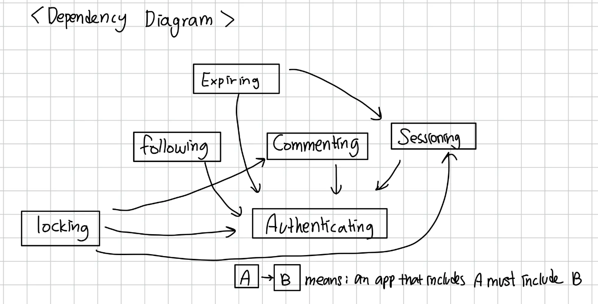

# Convergent Design

## Pitch

**Memorify**

*How often do you hear a song and remember a time, a place, or a person? What if you could bottle that feeling, and share it with others?*

Memorify is the ultimate app for music lovers who believe that songs are more than just background music - they’re gateways to cherished memories. Whether you listen to music on your daily commute, during a study session, or as part of your workout routine, Memorify helps you share your listening experience. With Memorify, music covers become a collection of memories - a unique combination of music, images, highlighted lyrics, or a personal anecdote that tells the story behind the listening experience. 

## Functional Design

### All Concepts:

- authenticating ✅
- sessioning ✅
- commenting ✅
- following ✅
- locking ✅
- expiring  ✅

### *concept* Authenticating [Username, Password]

- purpose: authenticate users on the app with given credentials
- state
    - `users`: set (Username, Password)
    - `authenticated`:  one username
- action
    - register (u: Username, p: Password)
        - if u not in users, add (u, p) to `users`
    - delete (u: Username, p: Password)
        - if `authenticated` and input p is correct, remove u from `users` and logout.
    - login (u: Username, p: Password):
        - if (u, p) exists in users, `authenticated`  is set to u
    - logout (u: Username):
        - if `authenticated` , set authenticated to null.
- operation principle:
    - only after register(u,p) can login(u,p), delete(p) happen
    - only after login(u,p) can logout(u) happen
    - usernames are unique

### concept Sessioning [User]

- purpose: enable authenticated actions for an extended period of time
- state
    - `active` : set Session
    - `user` : active → one User
- action
    - start(u: User)
        - create new session s for u
        - add s to `active`
        - associate s with u in `user`
    - getUser(s: Session)
        - if s in `active` ,  list `user` associated with s
    - end(s: Session)
        - ends user session

### concept Commenting [Author, Target, Body]

- purpose: Author responds to something (Target) by adding extra information (Body)
- state
    - `comment` (Author, Body) → Target
    - `Targets`  set Target
- action
    - add_comment (a: Author, t: Target, b: Body)
        - associate (a,b) with t to create a `comment`
    - delete_comment(t: Target)
        - find all the `comments` associated with t and remove them
    - view_comment(t: Target, a: Author)
        - find all the `comments` associated with t or a and returns them
- operation principle:
    - add_comment always needs all parameters a,t, b
    - only after login(u,p) can logout(u) happen
    - usernames are unique

### concept Following [User]

- purpose: Users can follow each other
- state
    - `users` : set of User
    - `following`: User → set of User
    - `followers` : set of User → User
- action
    - follow(u: User, t: User)
        - associate t with u and add it to `following`
        - associate u with t and add it to `followers`
    - unfollow(u: User, t: User)
        - find u → t relation and remove it from following
        - find t → u relation and remove it from followers
    - view_following(u: User)
        - allows u  to see the set of Users in `following`
    - view_followers(u: User)
        - allows u to see the set of Users in `followers`
- operation principle:
    - u1 can only follow u2 if u1 and u2 are both in `users`
    - only after follow(u,t) can unfollow(u,t) happen

### concept  Locking [User, Target, Condition] ✨

- purpose: User can lock a Target that they made that can be unlocked only when a certain Condition is met.
- state:
    - `locks` : Target → one (User, Condition)
    - `locked` : Condition → one Boolean (checks if the condition is satifsifed or not)
    - `locked_targets` : set Targets that are locked
- actions:
    - lock_target(u: User, t: Target, c: Condition):
        - u can lock t that they made with condition c
        - add relationship to `locks`
        - add relationship condition → False (since condition has not been sastifised)
    - unlock_target(t: Target, c: Condition):
        - t is unlocked when c has been satisfied
        - remove relationships from `locks` and modify relationship condition → True
    - fail_message(u: User, t: Target, c: Condition):
        - when user tries to unlock t but c has not been satisfied, show message that condition has not been satisfied.
- operation principle:
    - target can only be locked by its creator
    - only one condition per locked target
    - target should not be locked already for lock_target(u,t,c) to be called
    - unlock_target can only be called when c is satisfied
    - if c is not satisfied but user tries to unlock, fail_message is called

### concept Expiring [User, Target] ✨

- purpose: allows user to post target that will last only for 24 hours and expires. After it is saved, it is collected into an archive.
- state:
    - `valid_snapshots`: User →set Target
    - `expiration` : Target → Expiration Time
    - `archive` : User → set Target
- actions:
    - create_snapshot (u: User, t: Target, e: Time)
        - when u creates t, e is set to current time + 24
        - add t to `archive` and `snapshots`
    - expire_snapshot(u: User, t: Target)
        - when current_time > t.expiration, remove t from `valid_snapshots`
    - view_valid_snapshots(u: User)
        - return u.valid_snapshots
    - delete_snapshot(u: User, t: Target)
        - remove t from u.valid_snapshots, u.archive, remove t.expiration
    - delete_archive(u: User)
        - remove u.archive
    - view_archive(u: User)
        - return u.archive
- operation_principle:
    - delete_snapshot can only be done by user who created it
    - view_archive can only be done called by the archive owner, not other users.

### Some Extra Concepts

*(Extra: Not part of the 6 concepts for A4, but I added it because it will be a nice addition to have in the future)*

#### concept Collaborating [User, Target, Workspace] 

- purpose: If user is given access to collaborate on a target, they can modify it with other users on the Workspace
- state:
    - `targets` : Workspace → set of Targets (workspace can have multiple targets)
    - `access` : set Workspace → User (permission to access workspace)
    - `active` : Target → set of Users (tracks all users working on the target right now)
    - `owner` : one User (one user is the owner)
    - `members` : set Users (others are members)
- action
    - invite_member(u: User, w: Workspace)
        - u can invite other users to join their w where u is owner.
    - accept_invite(u: User, w: Workspace)
        - u accepts invite to join w
    - remove_member(u: User, w: Workspace)
        - u can remove other users from w where u is owner
    - remove_workspace(u: User, w: Workspace)
        - u can remove the workspace if u is owner
    - transfer_ownership(u1: User, u2: User, w: Workspace)
        - u1 can transfer ownership to u2 if u2 is already in w
    - add_target(u: User, t: Target, w: Workspace)
        - u can add new t to work on in w
    - track_active(t: Target)
        - keep track of all u currently active on t
- operation principle:
    - only owner of workspace can do invite_member(u,w), remove_member(u,w), remove_workspace(u,w), and transfer_ownership(u1,u2,w)
    - user can only do add_target if user is a member/owner of the workspace
    - ownership is unique
    - accept_invite(u,w) can only happen after invite_member(u,w)

#### concept Analyzing [User, Activity] ✨

- purpose: Analyze user habits and provide interactive visualization
- state:
    - `user_activites` User → set Activity (Track all activities done by user)
    - `insight` associated with each Activity
- actions:
    - add_activity(u: User, a: Activity)
        - if there is info inside and outside of the app we can use about the user, import it and add to user u’s activity a.
    - delete_activity(u: User, a: Activity)
        - deletes a from activities associated with user u
    - generate_insight(u: User, a: Activity)
        - create a insightful visualization about user u ‘s activity a.
    - update_insight(u: User, a: Activity)
        - when user u’s activity a is updated, find the corresponding `insight` and update it
    - delete_insight(u: User, a: Activity)
        - deletes `insight` associated with user u’s activity a.
- operation principle
    - only after add_activity(u,a) can generate_insight(u,a) be called
    - if activity is removed, it’s related insight needs to also be removed (call delete_insight(u,a))

### Synchronizations [app-level actions]

**app** Memorify

- **include** Authenticating [Username, Password] **include** Sessioning [User] **include** Commenting [User, JSON, JSON] **include** Following [User] **include** Collaborating [User, Target, Workspace] **include** Locking [User, JSON, String] include SnapShoting [User, JSON]
- sync add_cover(u: User, song: JSON, cover: JSON)
    - when Commenting.add_comment(user: Author, song: JSON, comment: JSON)
- sync login(u: Username, p: Password, s: Session)
    - when Authenticating.login(u,p)
    - Sessioning.start(u,s)
- sync logout(u: Username, s: Session)
    - when Authenticating.logout(u)
    - Sessioning.end(s)
- sync delete_user(u: Username, p: Password, s: Session)
    - when Authenticating.delete(u,p)
    - Sessioning.end(s)
    - Following.unfollow(u,t)
    - SnapShoting.delete_archive(u)

### Dependency Diagram

## WireFrames [Figma]

https://www.figma.com/design/W0Jprx9DVivS8PHJ6IsgJ2/Untitled?node-id=5-326&node-type=frame&t=LziZpyg7t5pAJAvF-0

## Design Tradeoffs

- Main Image in Polaroid Design
    - options for main image (before user clicks):
        - user’s profile picture (instagram-style)
        - the album art
        - user-uploaded image
    - my choice:
        - I decided to make the album image the main image with a small user profile beneath it. Clicking the album cover reveals the user-uploaded image as a memory tied to song, preserving the “reveal” effect while keeping the focus on music
- Choosing the main entry point
    - options
        - entry page shows a feed of other users’ activites
        - shows what user is currently listening to
    - my choice
        - I chose the second option because it provides an intuitive way for the users to capture a moment tied to the song they are currently listening too. Also, I thought it would be easier for the user to engage with the app immediately instead of trying to navigate the app
- Separating highlighted lyrics from user cover
    - options
        - try creating one square with highlighted lyrics + user image + user text input
        - create a distinct section for lyrics, separate from user text + image
    - my choice
        - i decided to separate the lyrics to give them their own space underneath the user content. I thought it would be too much if the lyrics are also on top of the user image, and by giving it it’s own section below, it would maintain clarity between the song’s official content and the user’s personal memory.