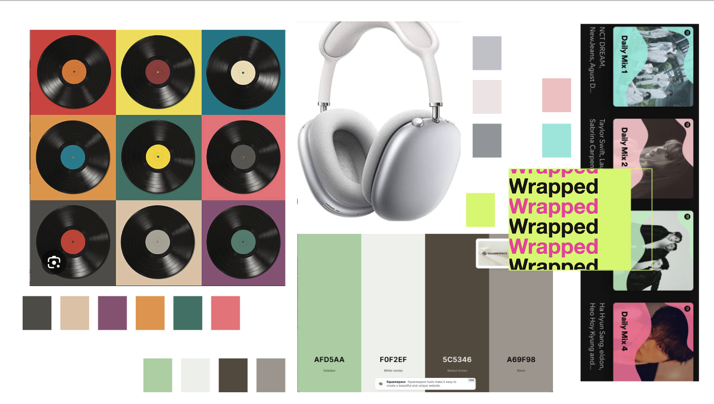

# Frontend Beta

## Frontend

Frontend deployment: https://memorify-omega.vercel.app/

Github Repo: https://github.com/hl105/frontend-starter

## Heuristic Evaluation

- **Usability criteria:** capture the broad overall goals that your visual and interactive designs might be trying to satisfy
    - *Discoverability:* how rapidly and easily can users understand how to operate the interface?
        - support: After the user logs in with their spotify credentials, they are immediately taken to the “currently listening to song”. There is a create button below it. This gives the users the general idea that they will be creating content about the song they are linstening to.
        - *violation*: A comment I got from my wireframe assignment was that it’s unclear how a `cover` and a `snapshot` is different. Basically, the difference is that a cover would come with `locking` whereas `snapshot` expires in 24 hours, and that users can upload additional text for a cover. For a user to easily understand this difference, I will illustrate the two posting options with a toggle button, so that the user knows they are two distinct posting options.
        - *tradeoff*: With the toggle button, the user can only post a cover OR a snapshot per creation, and they cannot do both at the same time.
    - *Efficiency:* once you know how to use an interface, can you use it to quickly and efficiently accomplish your goals?
        - support: A user can easily see other users and friend/unfriend them with a click, and accept/remove friend requests on the same page.
        - violation: I will make the user interaction more efficient by eliminating the two buttons `create cover` and `create snapshot`  that used to be on the first page after logging in. Instead, there will be one `create` button, and then they can toggle between a `cover` and a `snapshot`.
        - tradeoff: The default setting for the `explore` page is that all the users are displayed for the user to explore. However, once the number of users increase, this might be very inefficient. I decided to keep this design for now, since it’s easier for a user to find other users now with this default setting.
- **Physical heuristics:** describe characteristics about the user interface that affect how users might operate it
    - *Gestalt principles:* does the layout of the interface elements convey conceptual structure?
        - If the user is not logged in, the page will stay on the `log in` page. If the user tries to access any other page, it will tell them to log in first. This represents the conceptual structure that the user has to be logged in to initiate the other features.
        - When the user is logged in, a `post` is automatically created as the `currently listening to` page grabs the currently playing song and saves it as a post.
        - When user adds a image and text to the song `post` , it creates a `comment` (i.e.  `cover` or `snapshot`).
    - *Situational context:* how does the interface convey to a user their context (where they are, the app’s state, etc.), and how does it adapt to their context?
        - On the top right, the user profile will indicate that the user is logged in. If the user is not logged in, there will be a `log in` sign instead.
        - For the `currently listening to` part that is the first screen after the user logs in, if the user is not listening to a song right now, it will instead show a message that says `you are not listening to a song right now!` sign.
- **Linguistic level:** describe cultural conventions and norms about the interface
    - *Consistency:* does the interface reuse the same names, symbols, and icons for the same concepts or actions? how consistent is the interface with others across the same application domain or platform?
        - I will stick to `cover` and `snapshot` . The conceptual words like `post`  or `comment` is only for the backend data storage, as the user is commenting to a song post.  However, this is a problem I’ve been thinking about — for easier backend improvements, it might be worth it to change all the backend “posts” into “songs”, or change all the comments into “covers” and “snapshots.”
    - *Information scent:* how does the interface provide hints for navigation to aid a user in “foraging” for information?
        - The user, once logged in, will always start at the `currently listening to` page so that they can easily create a `cover`  or a `snapshot` . I will also use the top navigation bar that contains links to the main page and user profile.
        - The explore page provides an intuitive way to find users and connect with them, with reactive buttons that adds a user to the friend/friendrequest docs.
        - I also made sure to place the routes in the navigation bar, so that the users can easily find their way back to the pages that they wish to visit.

## Visual Design Study

I want to use colors that are associated with music, which is my references are from Apple Airpod Max, Spotify Playlist / Wrapped, etc. I plan to use a minimal number of colors as I plan to use the album cover itself as a background, so I'll probably choose a color or two from this palette.

Likewise, I want to use a minimal number of fonts, if not only one. Gills Sans seems simple and known for its legibility, so I plan to use this one.

## GPT USE
Like for the backend implementation, I used GPT to debug. Also, I used it for css a lot, such as adding the vinyl animation. 