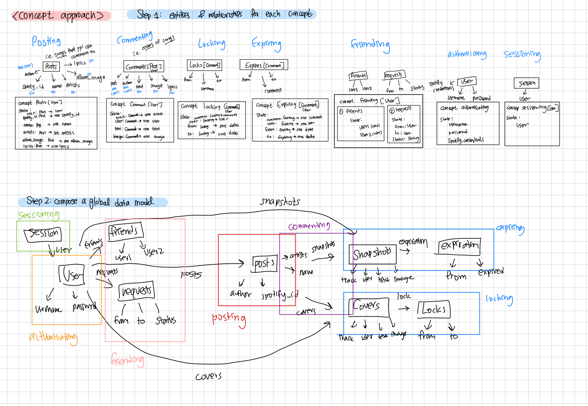

# Backend (Alpha) 



- full code in https://github.com/hl105/backend-starter

additional notes:

- I had one `comments` concept, and implemented it in two ways: `snapshots` and `covers` This allowed me to neatly describe the relationship between <snapshot and expiration> and <covers and locks> this is because expiring can only happen to snapshots and locks can only happen to covers.
- I know we have to make concepts as generic as possible, but the only way I can make comments generic is to have a `post` and a `content` in the interface, instead of the `post` , `user`,  `text`, `image`, `lyrics` have right now. However, I wasn’t sure how to match the number of parameters here while making it generic. i.e. with only 1 content, I would not be able to store all user, text, image, and lyrics. I would have to extend the commenting concept to make another musicCommenting concept or something if I wanted to do this. So I just made the interface of `commenting` non generic. I’ll go to office hours next week to make sure though!

Interfaces:

```tsx
export interface LockDoc extends BaseDoc {
  content: ObjectId;
  locker: ObjectId; //person who locked it
  from: string;
  to: string;
}

export interface ExpiredDoc extends BaseDoc {
  content: ObjectId;
  created: string;
}

export interface NotExpiredDoc extends BaseDoc {
    content: ObjectId;
    created: string;
}

export interface CommentDoc extends BaseDoc {
  post: ObjectId;
  author: ObjectId;
  text: string;
  lyrics: string;
  image: string;
}

export interface UserDoc extends BaseDoc {
  username: string;
  password: string;
  // spotifyId: string;
  // accessToken: string;
  // refreshToken: string;
}

export interface PostDoc extends BaseDoc {
  author: ObjectId;
  content: string;
  options?: PostOptions;
  //for now, planning on adding more after I figure out how Spotify authenication works
}

export interface FriendshipDoc extends BaseDoc {
  user1: ObjectId;
  user2: ObjectId;
}

export interface FriendRequestDoc extends BaseDoc {
  from: ObjectId;
  to: ObjectId;
  status: "pending" | "rejected" | "accepted";
}

```