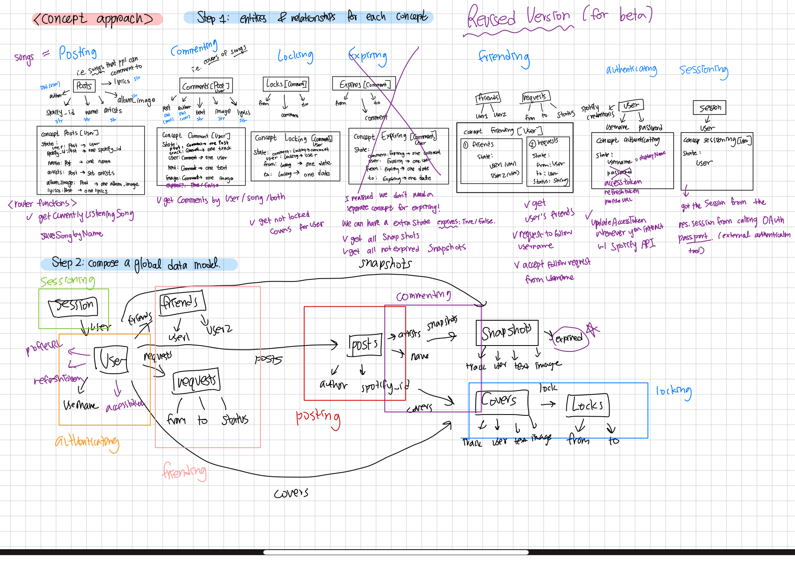

# Backend (Beta) 

- full code in https://github.com/hl105/backend-starter
- deployed service: https://backend-starter-steel.vercel.app/

## **Design Reflection**

The biggest design choice I made was to delete the `expiring` concept that I had in the alpha part. For context, I had been thinking about ways to generalize the two different user `commenting` methods. (By commenting, I mean that a user “comments” their thoughts or upload images to a `song` , i.e. a `song = post`, `user content = comment of a song`. ) So a user could comment their thoughts by 1. commenting a `cover` or 2. commenting a `snapshot` . The difference is that a `cover` can be locked, i.e. if a user locks a cover for 10 days, the cover disappears for 10 days and reappears after that. On the other hand, `snapshot` expires strictly after 24 hours, and after that only the user can see it. So here is where my design decisions came in: the `cover` and `snapshots` are similar enough to be generalized into a `commenting` concept, but how will I implement the different `locking` and `expiring` features? I decided to add an *optional* `expired` state to the `comment`data model. However, for locked, we have a lot more additional states to care about. You would need to know who locked it and for how long. Also, the locking concept could easily be applied to other features of my app in the future, so I decided to keep `locking`  as a concept whereas `expiring` simply became a state. A user could calculate if a `snapshot` expired by calling a functions that updating the `expired` state every time they request to get a `snapshot` : the function would look at the comment created time and subtract it from the current time to see if 24 hours have passed yet or not. 

## Comments / Design Decisions for Backend Implementations

I want to highlight that while the 6 concepts that I have for my app may not seem novel at first glance, I modified them so that it will fit the purpose of my app. For instance, all posts are created by Spotify API calls - this required me to set up a Spotify Developers account, get client credentials, and set up a Spotify strategy for the passport OAuthentication. I also added functions that will refresh the `accessToken` using the permanent `refreshToken` every time the user asks for the song they are listening to right now. As I briefly mentioned above, I generalized the `commenting` concept that we can reuse it for two parts of my app: `covers` and `snapshots` .

## How I used GPT

- I used GPT to debug Spotify API calls. I used an external package called `passport-spotify`  that handles the OAuth process for Spotify, and got error messages everywhere that I debugged one by one:
    - The existing code that we were given was `fetch` , which displays the response in the current page. However, I had to direct the users to an external login page and redirect them back with a callback function. Thus, I had to change some of the code outside of what we were assigned, such as using `redirect` with `encodeURIComponent` . GPT helped me debug.
    - I was not familiar with using `passport` , and this made things a bit tricky because of the way it handles sessions. I got the `req.session` from the Spotify authentication and assigned that to our `sessioning` object. GPT helped me with the syntax and how I should be saving and destroying this session.