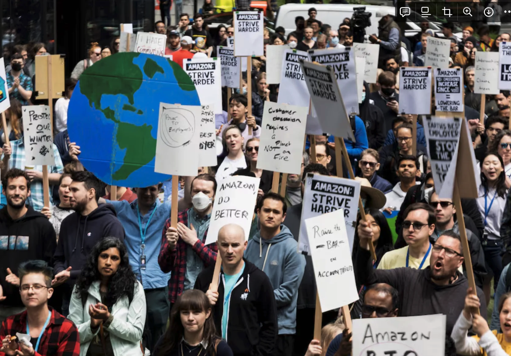

In this week’s lecture, we had the chance to think about responsible technology and how to use different frameworks (such as the data ethics canvas) to “not build something you will regret.” I remember a question that I resonated with a lot in class was “a lot of these frameworks seem to be only applicable if you are a founder — what change can we make as an employee of a company, which most of us would end up as; at least at the start of our career?” 

As a response to this question, Lyel mentioned how thousands of engineers at Google protested a government contract, Project Maven, that Google was considering joining. By participating in the project, the company would have assisted the military in using Artificial Intelligence to monitor and analyze drone surveillance footage. The protest resulted in AI guidelines for future military contracts that “violate internationally accepted norms.” I found this example empowering, since this was a question I have been thinking about for a while too. If I join a large tech company as not even a entry-level position, but just as an intern, would I be able to voice out my concerns if I didn’t agree with a company policy?

Turns out there are many examples of employees raising ethical concerns about the technology they were building that ended up creating significant impact. One example would be the Amazon walk-out that happened just last year, in protest of the company’s change in climate policy. There was an internal group that organized the walkout, known as Amazon Employees for Climate Justice (AECJ). In response, Amazon released a statement saying they take employees’ feedback very seriously and said “"we remain on track to get to 100% renewable energy by 2025.” Another example would be when back in 2019, hundreds of Facebook employees signed a internal letter, voicing their concerns about political ads and Facebook’s lack of control over misinformation on the platform. This movement brought public awareness to Facebook’s new policies, and urged Facebook towards more accountability regarding misinformation.

I hope that I will be able to talk to my co-workers and voice my concerns confidently, just like the employees in the stories I read.

